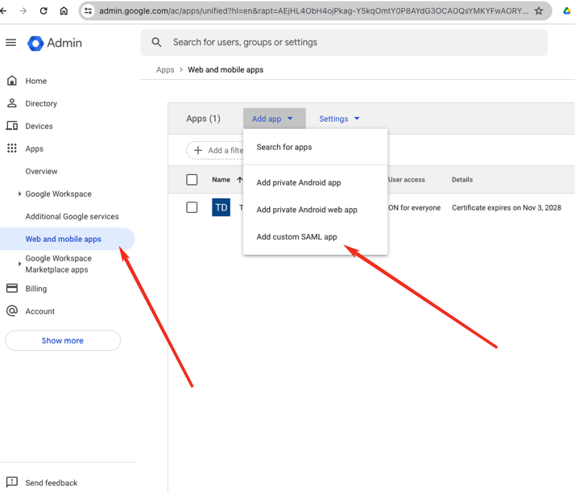
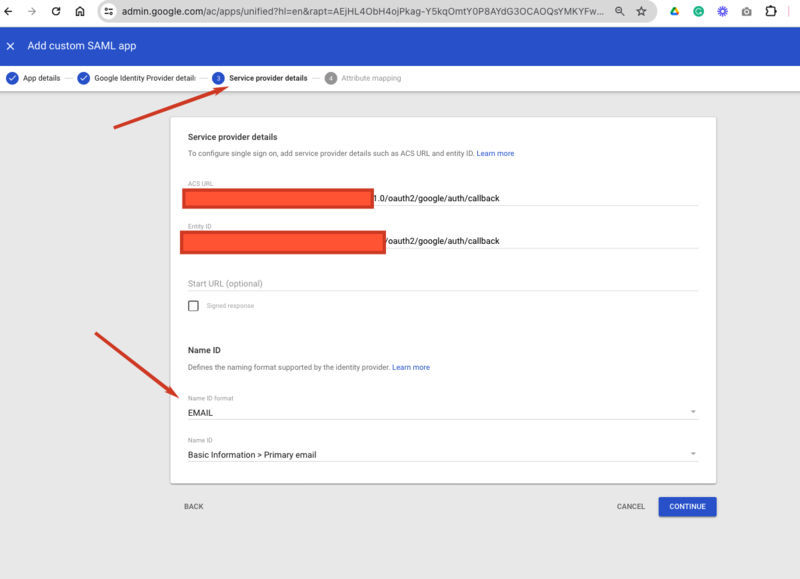
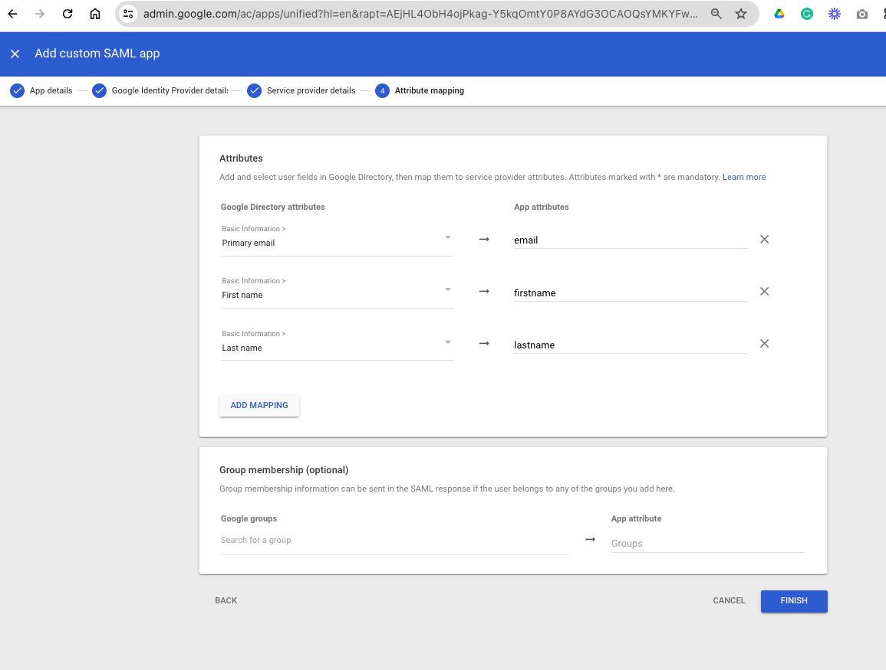
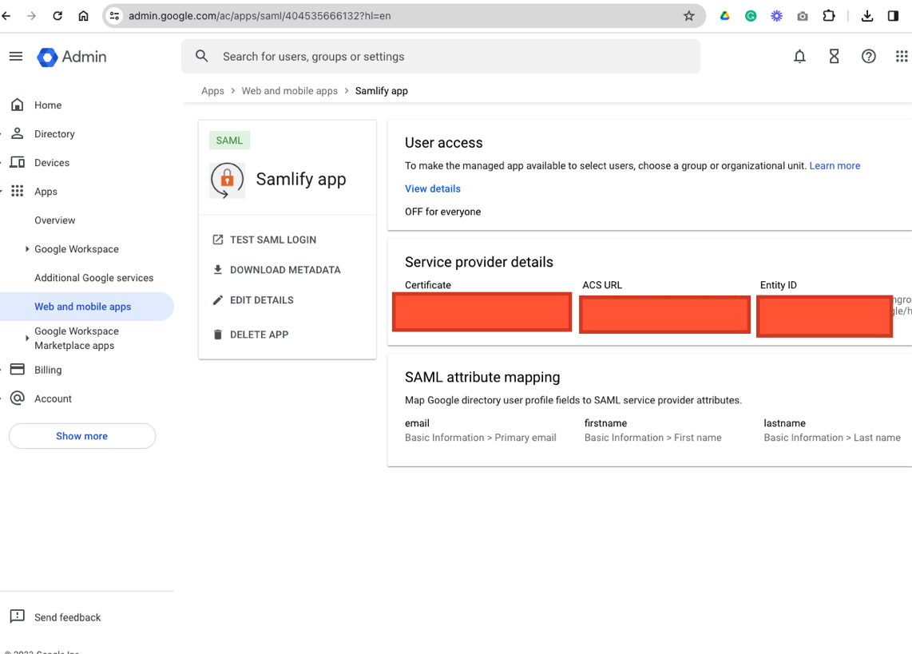

## Implementing Google SSO with SAML2.0 using Samlify

### Introduction

This document provides a step-by-step tutorial for implementing Single Sign-On (SSO) with Google Workspace using SAML2.0. We will create a sample application that implements SP-initiated SSO (Service Provider-initiated SSO).

### Credits

Credit for this tutorial goes to [@hmagdy](https://github.com/hmagdy).

### Prerequisites

Before you begin, make sure you have the following prerequisites installed in your project:

- Samlify
- Express (or any other Node.js web framework)
- Body-parser

### Tutorial

#### Step 1: Create a New Web App in Google Workspace

- In your Google Workspace admin console, create a new web app with SAML2.0 integration. You can follow the steps provided by Google to set up the app.



#### Step 2: Retrieve IdP (Identity Provider) Metadata

- Once your app is created, copy the following information from the IdP metadata (Step 2):
  - Identity Provider Entity ID
  - Identity Provider Single Sign-On (SSO) URL
  - Identity Provider Certificate

```javascript
// IdP (Identity Provider) metadata
const identityProviderEntityID = 'https://accounts.google.com/o/saml2?idpid=XYZ';
const identityProviderSsoURL = 'https://accounts.google.com/o/saml2/idp?idpid=XYZ';
const identityProviderCert = `-----BEGIN CERTIFICATE-----
XYZ
-----END CERTIFICATE-----`;
```

#### Step 3: Configure Callback URL for Service Provider

- Add the callback URL for your Service Provider (SP) details as provided in your application setup.



#### Step 4: Set Up Attribute Mapping

- Configure attribute mapping for your application as needed.



#### Step 5: Application Setup

- Your application is now ready for SSO integration.



#### Step 6: Example Code Configuration

- Use the following code snippet as an example to configure your Node.js application for SSO:

```javascript
const samlify = require('samlify');

// Set up schema validation (customize as needed)
samlify.setSchemaValidator({
  validate: (response) => {
    console.log('response', response);
    return Promise.resolve('skipped');
  },
});

// SP (Service Provider) metadata
const serviceProviderEntityID = 'https://your-app-url/google/sso/callback';

// IdP (Identity Provider) metadata
const identityProviderSsoURL = 'https://accounts.google.com/o/saml2/idp?idpid=XYZ';
const identityProviderEntityID = 'https://accounts.google.com/o/saml2?idpid=XYZ';
const identityProviderCert = `-----BEGIN CERTIFICATE-----
XYZ
-----END CERTIFICATE-----`;

const idp = samlify.IdentityProvider({
  entityID: identityProviderEntityID,
  signingCert: identityProviderCert,
  isAssertionEncrypted: false,
  singleSignOnService: [
    {
      Binding: samlify.Constants.namespace.binding.redirect,
      Location: identityProviderSsoURL,
    },
    {
      Binding: samlify.Constants.namespace.binding.post,
      Location: identityProviderSsoURL,
    },
  ],
});

const sp = samlify.ServiceProvider({
  entityID: serviceProviderEntityID,
  isAssertionEncrypted: false,
  assertionConsumerService: [{
    Binding: samlify.Constants.namespace.binding.post,
    Location: serviceProviderEntityID,
  }];

// Implement express with APIs for callback, login request, and metadata endpoints as needed
const express = require('express');
const fs = require('fs');
const saml = require('samlify');
const axios = require('axios');
const bodyParser = require("body-parser");
const app = express();
app.use(bodyParser.urlencoded({ extended: true }));
app.use(bodyParser.json());
app.use(serveStatic(path.resolve(__dirname, 'public')));

// callback
  app.post('/google/sso/callback', async (req, res) => {
    try {
      const { extract } = await sp.parseLoginResponse(idp, 'post', req);
      const result = {
        obj: extract.attributes,
      };
      next(result);
    } catch (e) {
      console.log('[FATAL] when parsing login response sent from Google');
      console.log(e);
    }
    return;
  });

  app.get('/login', async (req, res) => {
        const { context } = sp.createLoginRequest(idp, 'redirect');
        return res.redirect(context);
      });

  app.get('/google/sso/metadata', (req, res) => {
    console.log("here");
    res.header('Content-Type', 'text/xml').send(idp.getMetadata());
  });

// Start the application
app.listen(port, () => {
  console.log(`Server is running on port ${port}`);
});
```

This code sets up the SSO configuration for your application.

That's it! You have successfully set up SSO with Google Workspace using SAML2.0 for your web application. You can customize and extend this code to suit your specific requirements.