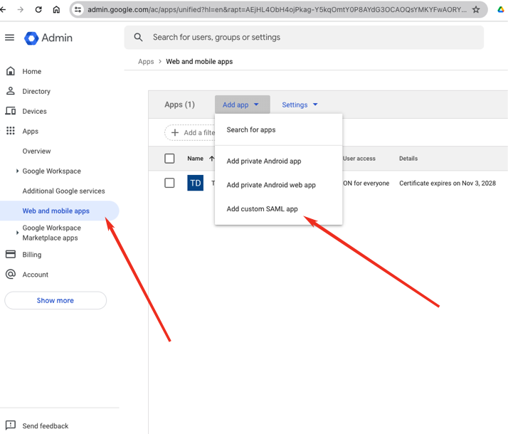
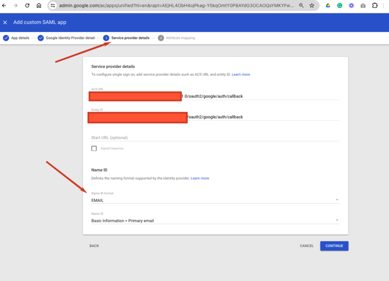
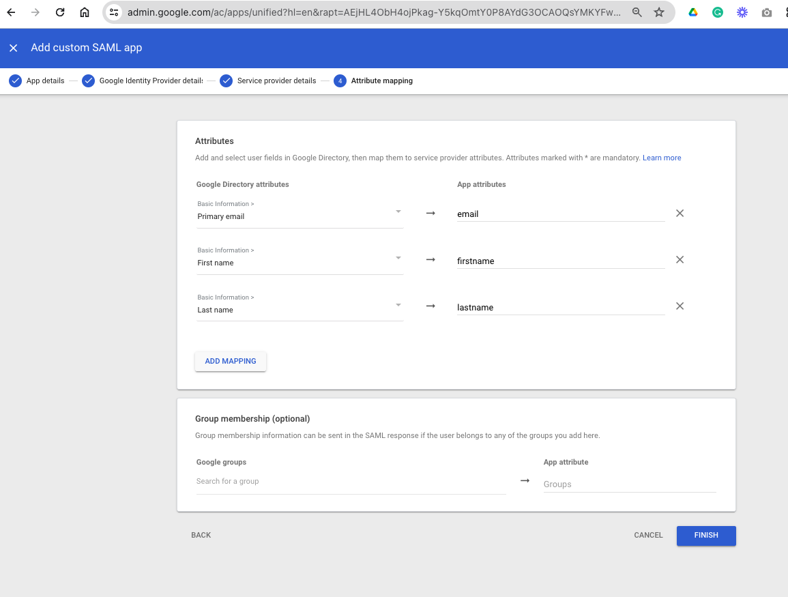
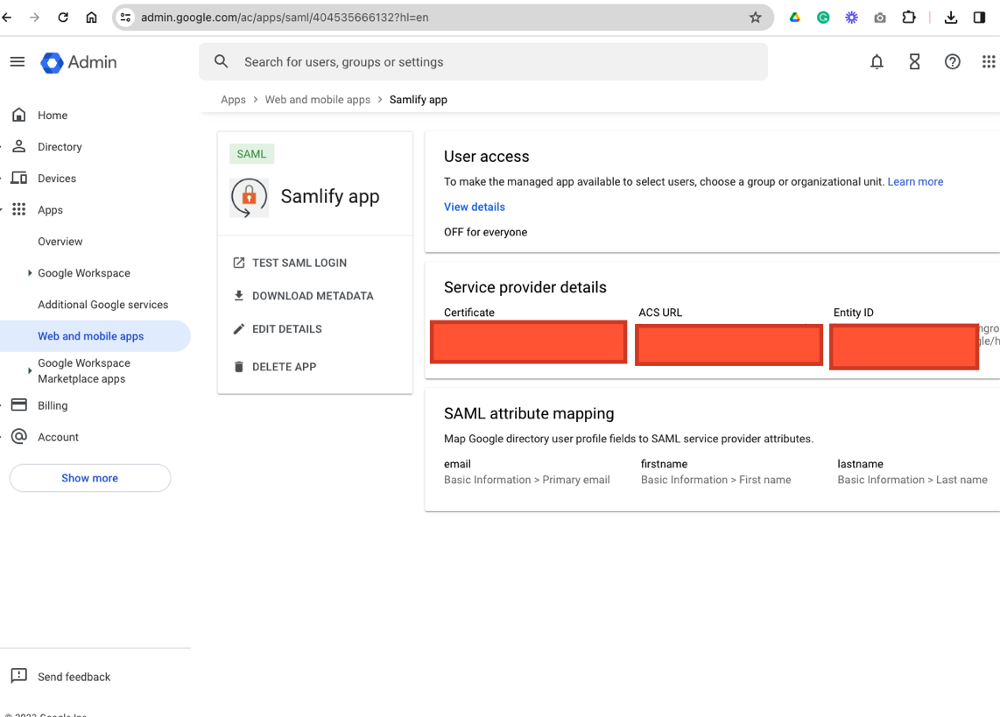

# Google Workspace SSO with SAML 2.0 using samlify

## Introduction

This chapter walks through an SP-initiated SSO integration with Google Workspace using SAML 2.0.

## Credits

Credit for this tutorial goes to [@hmagdy](https://github.com/hmagdy).

## Prerequisites

Before starting, install the following dependencies in your project:

- samlify
- Express (or another Node.js web framework)
- body-parser

## Tutorial

### Step 1: Create a new SAML 2.0 web app in Google Workspace

In the Google Workspace admin console, create a new web app with SAML 2.0 integration, following the Google setup instructions.



### Step 2: Retrieve IdP metadata

Once the app is created, copy the following values from the IdP metadata (Step 2 in the Google wizard):

- Identity Provider Entity ID
- Identity Provider Single Sign-On (SSO) URL
- Identity Provider Certificate

```javascript
// IdP metadata.
const identityProviderEntityID = 'https://accounts.google.com/o/saml2?idpid=XYZ';
const identityProviderSsoURL   = 'https://accounts.google.com/o/saml2/idp?idpid=XYZ';
const identityProviderCert = `-----BEGIN CERTIFICATE-----
XYZ
-----END CERTIFICATE-----`;
```

### Step 3: Configure the SP callback URL

Add the callback URL declared in your application configuration.



### Step 4: Configure attribute mapping

Configure the attributes Google Workspace should send in the assertion.



### Step 5: Finalise the application setup

The application is now ready for SSO integration.



### Step 6: Example configuration

```javascript
const samlify = require('samlify');

// Supply a schema validator. Replace with your own implementation in production.
samlify.setSchemaValidator({
  validate: (response) => {
    console.log('response', response);
    return Promise.resolve('skipped');
  },
});

// SP metadata.
const serviceProviderEntityID = 'https://your-app-url/google/sso/callback';

// IdP metadata.
const identityProviderSsoURL   = 'https://accounts.google.com/o/saml2/idp?idpid=XYZ';
const identityProviderEntityID = 'https://accounts.google.com/o/saml2?idpid=XYZ';
const identityProviderCert = `-----BEGIN CERTIFICATE-----
XYZ
-----END CERTIFICATE-----`;

const idp = samlify.IdentityProvider({
  entityID: identityProviderEntityID,
  signingCert: identityProviderCert,
  isAssertionEncrypted: false,
  singleSignOnService: [
    {
      Binding: samlify.Constants.namespace.binding.redirect,
      Location: identityProviderSsoURL,
    },
    {
      Binding: samlify.Constants.namespace.binding.post,
      Location: identityProviderSsoURL,
    },
  ],
});

const sp = samlify.ServiceProvider({
  entityID: serviceProviderEntityID,
  isAssertionEncrypted: false,
  assertionConsumerService: [{
    Binding: samlify.Constants.namespace.binding.post,
    Location: serviceProviderEntityID,
  }],
});

// Express setup for the callback, login, and metadata endpoints.
const express = require('express');
const fs = require('fs');
const saml = require('samlify');
const axios = require('axios');
const bodyParser = require('body-parser');
const app = express();
app.use(bodyParser.urlencoded({ extended: true }));
app.use(bodyParser.json());
app.use(serveStatic(path.resolve(__dirname, 'public')));

// SAML callback endpoint.
app.post('/google/sso/callback', async (req, res) => {
  try {
    const { extract } = await sp.parseLoginResponse(idp, 'post', req);
    const result = { obj: extract.attributes };
    next(result);
  } catch (e) {
    console.log('[FATAL] failed to parse the login response from Google');
    console.log(e);
  }
  return;
});

// Login entry point.
app.get('/login', async (req, res) => {
  const { context } = sp.createLoginRequest(idp, 'redirect');
  return res.redirect(context);
});

// Metadata endpoint.
app.get('/google/sso/metadata', (req, res) => {
  res.header('Content-Type', 'text/xml').send(idp.getMetadata());
});

// Start the application.
app.listen(port, () => {
  console.log(`Server is running on port ${port}`);
});
```

That completes the SSO setup for Google Workspace with SAML 2.0. Adapt the code to your application's specific requirements.
